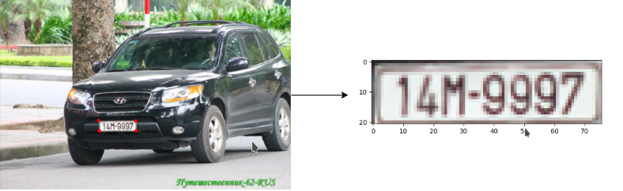
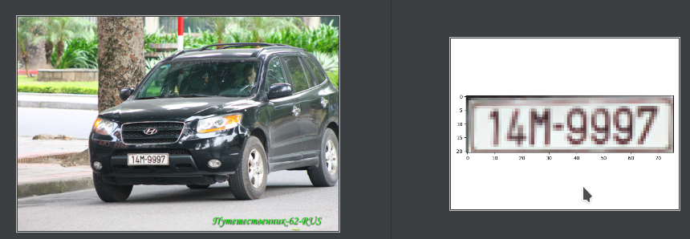
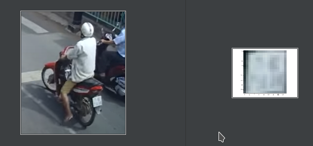
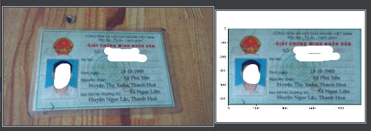

## Object-Corner-Detection: Crop an object from four corners
License Plate Detection, ID Detection, Vietnam License Plate Detection \
***Idea***: Corners as keypoints, a Centernet modify version
- Different:
    + Modify from bounding box detection to keypoint detection 
    + Add augmentations 
        
~ By Hisiter-HUST ~ 




Note:
- This repository can apply to:
  + License Plate Detection 
  + ID Detection 
  + ...

Keywords: Vietnam License Plate Detection, ID Vietnam Detection
## 1. Set up environment and dependent packages
- Step 1: Clone repository:
```bash 
git clone https://github.com/hisiter97/Object-Corner-Detection.git
```
- Step 2: Set up conda environment (require conda is installed, if not, [install conda](https://docs.conda.io/projects/conda/en/latest/user-guide/install/)):
```bash
conda env create -f environment.yml
conda activate py36_torch1.4
```
- Step 3: Build DCNv2:

```bash
sh build_dcnv2.sh
```
**Note** 

    * Build successfully if the output has line ***Zero offset passed*** or ***Passed gradient***
    * If there is any error, try downgrade cudatoolkit  
## 2. Dataset format 
- Prepare custom dataset: [DATA.md](https://github.com/hisiter97/Object-Corner-Detection/blob/master/data/DATA.md)
- Format data: COCO
- Structure
```text

${Object-Corner-Detection_ROOT}
|-- center
|-- data
`-- |-- plate
    `-- |-- annotations
            |-- train_plate.json
            |-- val_plate.json

        |---images
            |--img_1.jpg
            |--img_2.jpg
```
## 3. Training:
- Edit config file at the center/config directory 
```bash
cd center 
python train.py --config config/plate.yml 
```

## 4. Testing:
- Download pretrained model: 
    + Vietnam License plate: https://drive.google.com/file/d/1GZKi1F7nKLT0d7uLLGewkm4LknqDS57F/view?usp=sharing
    + ID Vietnam: https://drive.google.com/file/d/1igdw06UTw1SZxGa7JUCB-Vm3YiWl1cpt/view?usp=sharing
    
- Edit line ***weight*** in file config.yml 
```bash
cd center
python detect.py --config config/plate.yml --image_path ../img_test/plate.jpg 
```

## 5. DEMO 




### **TODO**
- [ ] Generate point annotation from testing  
- [ ] Detect object from 2,3 points
- [ ] Debugger
- [ ] Invisible keypoint
